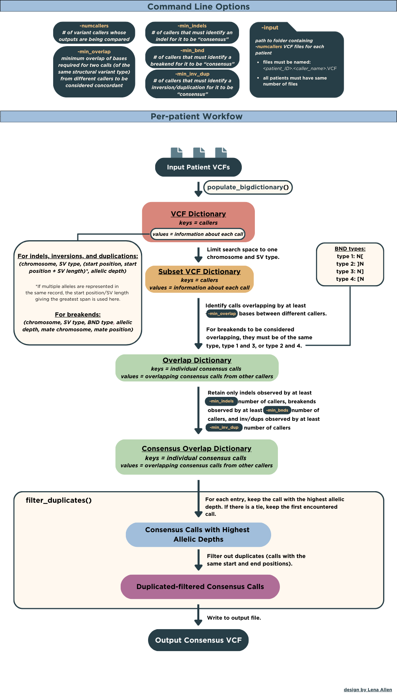

# BGMP Student Project 2024

Lena Allen, Lauren Williams, Maura Kautz, Abraham Solomon

## VCF Consensus Tool

### Overview

This tool generates a set of high-confidence structural variants from the output files of 2 or more long-read structural variant callers. The tool recognizes structural variants as insertions, deletions, duplications, inversions, and translocations. Structural variants are included or excluded in the final consensus output for each sample based on concordant identification of structural caraints between callers. Command line options will control sensitivity of consensus identification.

### Usage

#### To Run:

```llcombo_clean.py -input <absolute path to input folder> -output <absolute path to output folder> -numcallers <number of callers being compared> -min_indels <number of callers identifying indel> -min_bnds <number of callers identifying breakend> -min_inv_dup <number of callers identifying inversion or duplication> -min_overlap <number of overlap bases required>```

#### Command Line Options:

***-input***: Absolute path to a folder containing all VCF files for all samples.

***-output***: Absolute path to a folder which will hold all VCF consensus files. Folder must already exist, folder will not be made automatically.

***-numcallers***: The number of variant callers whose output VCF files are being compared. Must be at least 2 callers.

***-min_indels***: The number of variant callers that must identify an indel (insertion or deletion) for it to be included in the consesus output. Must be at least 2 callers.

***-min_bnds***: The number of variant callers that must identify a breakend (translocation) for it to be included in the consensus output. Must be at least 2 callers.

***-min_inv_dup***: The number of variant callers that must identify an inversion or duplication for it to be inlcuded in the consensus output. Must be at least 2 callers.

***-min_overlap***: Minimum overlap of bases required for two variants from different callers to be considered concordant. Defaults to 1 base unless otherwise specified.

*By increasing the number of callers that must identify a structural variant, the output consensus files will contain less, but higher quality data. Similarly, increasing the number of overlapping bases required will restrict the number of consensus variants found. It is recommended to begin with few restrictions, and increase as needed.*

## Consensus Tool Workflow


